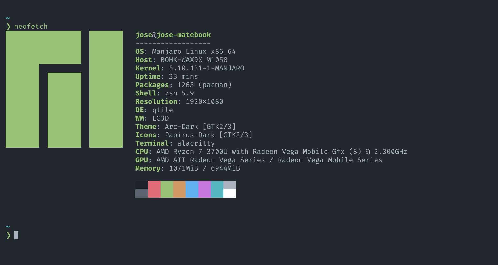

# 🤖 Alacritty - Configuración

En este repositorio se encuentran mis archivos de configuración de Alacritty.

## 🖼️ Preview



## 🤔 ¿Qué es Alacritty?

Alacritty es un moderno emulador de terminal que permite una amplia configuración y proporciona un alto rendimiento ya que hace uso de la GPU.Las plataformas soportadas actualmente son BSD, Linux, macOS y Windows.

[Aquí puedes ver su sitio web oficial](https://alacritty.org/)

## 🚀 ¿Como usar?

Primero clona el repositorio desde GitHub.

```shell
git clone https://github.com/JoseLuria/alacritty-config.git
```

Muévete la carpeta **alacritty-config** del proyecto al la ruta **~/.config** y renombrala como **alacritty**.

```shell
cp -r alacritty-config ~/.config/alacritty
```

## 📄 Licencia

[MIT](https://opensource.org/licenses/MIT)
